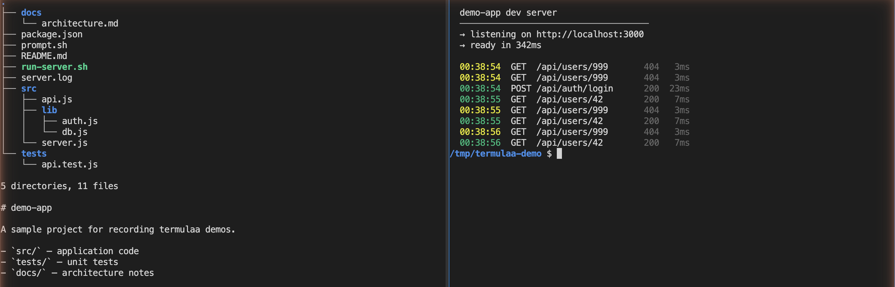
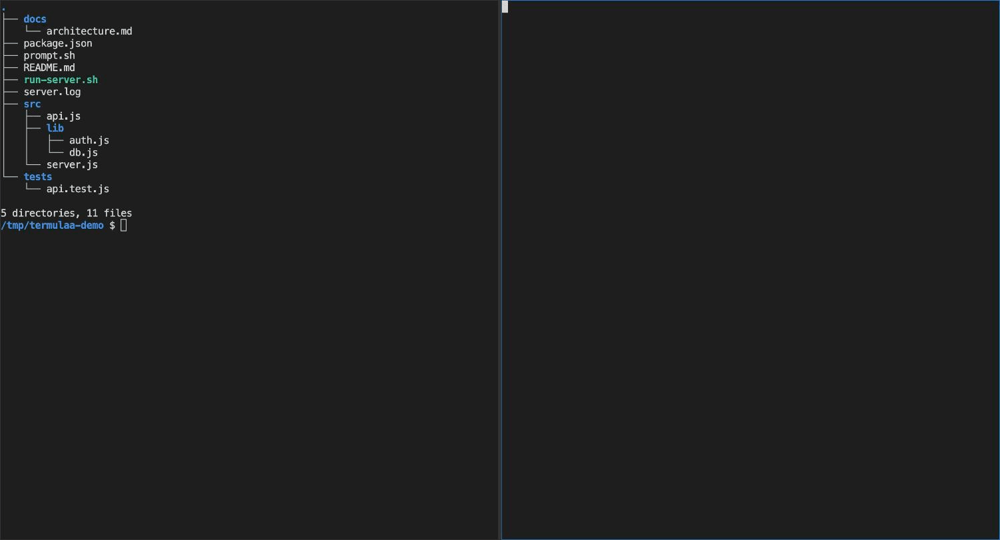

# termulaa

[](https://github.com/sudiptadeb/termulaa/actions/workflows/build.yml)
[](https://github.com/sudiptadeb/termulaa/releases/latest)
[](LICENSE)
[](src/go.mod)

**Put your terminal — and your coding agents — in a browser tab, right
next to the webapp they're working on.** Live reload in one tab, Claude
Code / Codex / OpenCode in the next. If your browser has workspaces or
tab groups, group the terminals with the project they belong to and
switch between projects cleanly.

Persistent PTY sessions that survive tab close, tabs with binary pane
splits, scrollback replay on reconnect, per-session CWD tracking. Single
small Go binary. Loopback-only — see [SECURITY.md](SECURITY.md).



## Install

### `go install` (recommended if you have Go)

```bash
go install github.com/sudiptadeb/termulaa/src/cmd/termulaa@latest
termulaa
```

### One-liner (downloads the latest release binary)

```bash
curl -fsSL https://raw.githubusercontent.com/sudiptadeb/termulaa/main/install.sh | bash
```

Detects OS (linux/darwin) and arch (amd64/arm64), installs to
`~/.local/bin/termulaa`.

### Manual

Grab the binary for your platform from the
[Releases page](https://github.com/sudiptadeb/termulaa/releases/latest)
and drop it somewhere on your `PATH`.

### From source

```bash
git clone https://github.com/sudiptadeb/termulaa
cd termulaa
build/build.sh              # cross-compiles to dist/<os>/
./dist/darwin/termulaa-arm64-v0.1.0
```

## Run

```bash
termulaa
```

Then open <http://127.0.0.1:17380/> in your browser.

Change the port with `-port 17381`, or edit settings at
`http://127.0.0.1:17380/settings`.

### macOS Gatekeeper

The release binaries aren't signed or notarized. On first run macOS will
refuse to open them. Fix:

```bash
xattr -d com.apple.quarantine ~/.local/bin/termulaa
```

## Why

`ttyd` + `tmux` gets you "browser-rendered PTY with persistence," but
with seams — reattaching doesn't replay scrollback cleanly, layout lives
in tmux, and `ttyd` has no tab or pane concept of its own. termulaa
folds the pieces into one small binary and aims it at one use case: a
browser tab you leave open next to whatever you're building.

- **Persistent sessions** — the PTY stays alive after the browser tab
  closes; reconnecting replays the scrollback ring buffer.
- **Tabs + binary pane splits** — layout is first-class, persisted per
  tab. `Cmd/Ctrl+D` splits vertically, `Cmd/Ctrl+Shift+D` splits
  horizontally.

  

- **Dead-session revival** — if the PTY exited, the on-disk scrollback
  replays and a new shell spawns in the last-known cwd.
- **Per-session CWD tracking** — follows `/proc/<pid>/cwd` on Linux,
  `lsof -p` on macOS.
- **Shell history** — per-session `HISTFILE`.
- **Side-by-side with your work** — it's a browser tab, so workspaces
  and tab groups work out of the box.

## Layout

```
build/build.sh       # cross-compile to dist/<os>/
src/cmd/termulaa/    # Go sources + embedded ui/
resources/plans/     # design docs
resources/scripts/   # run + benchmark helpers
resources/images/    # README screenshots + GIFs
```

Two Go dependencies: [`creack/pty`](https://github.com/creack/pty) and
[`gorilla/websocket`](https://github.com/gorilla/websocket). Frontend is
vendored — Alpine.js, Twind, xterm.js + addons — no npm, no bundler, no
build step.

## Runtime state

```
~/.termulaa/
  config.json             # user settings (port, shell, scrollback size, ...)
  state.json              # tabs + session metadata
  scrollback/<id>.raw     # per-session raw PTY output (ring buffer)
  history/<id>.hist       # per-session shell HISTFILE
```

Settings are editable in-app at `/settings` or via `GET/PUT
/api/settings`.

## Platform support

Builds produced by `build/build.sh` and the release workflow:

- `darwin/amd64`, `darwin/arm64`
- `linux/amd64`, `linux/arm64`

**Windows is not supported.** PTY handling via `creack/pty` is
POSIX-only; Windows would need a ConPTY port. Tracked as an open issue.

## Security

Loopback-only (`127.0.0.1`). Host-header allowlist and strict Origin
checks on both HTTP and WebSocket. Any page open in a browser on the
same machine can still talk to the server if it uses the right Host —
accepted risk for a single-user dev tool. Full threat model and the
controls required before exposing on a non-loopback interface are in
[SECURITY.md](SECURITY.md).

## License

[MIT](LICENSE)
