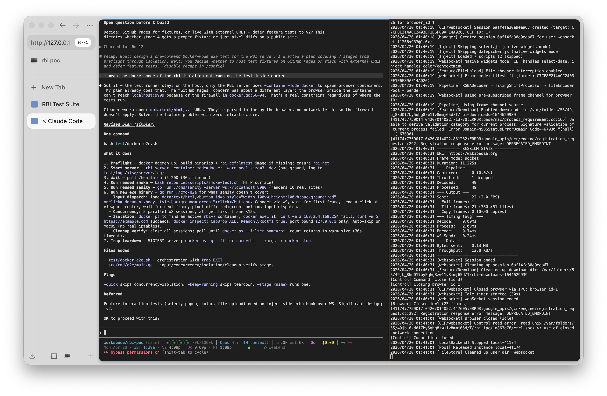
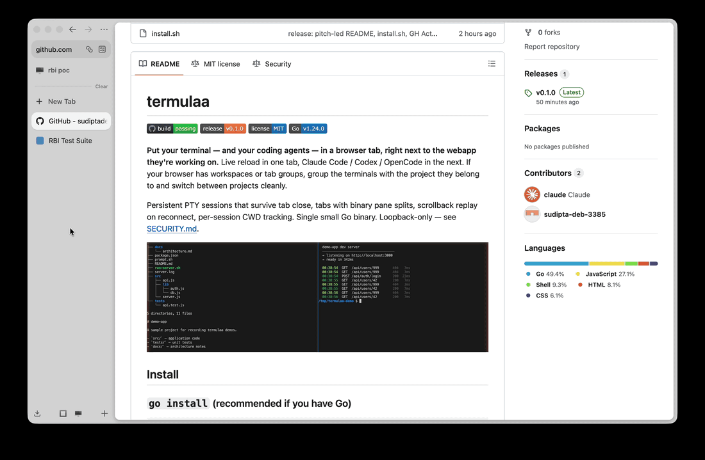
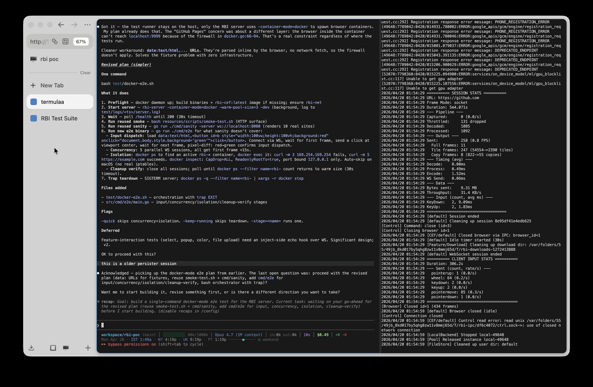

# termulaa

[](https://github.com/sudiptadeb/termulaa/actions/workflows/build.yml)
[](https://github.com/sudiptadeb/termulaa/releases/latest)
[](LICENSE)
[](src/go.mod)

**Put your terminal — and your coding agents — in a browser tab, right
next to the webapp they're working on.** Live reload in one tab, Claude
Code / Codex / OpenCode in the next. If your browser has workspaces or
tab groups, group the terminals with the project they belong to and
switch between projects cleanly.

Persistent PTY sessions that survive tab close, tabs with binary pane
splits, scrollback replay on reconnect, per-session CWD tracking. Single
small Go binary. Loopback-only — see [SECURITY.md](SECURITY.md).



## Install

### `go install` (recommended if you have Go)

```bash
go install github.com/sudiptadeb/termulaa/src/cmd/termulaa@latest
termulaa
```

### One-liner (downloads the latest release binary)

```bash
curl -fsSL https://raw.githubusercontent.com/sudiptadeb/termulaa/main/install.sh | bash
```

Detects OS (linux/darwin) and arch (amd64/arm64), installs to
`~/.local/bin/termulaa`.

Re-running the same command upgrades in place: it compares
`termulaa -version` against the latest release, replaces the binary
only when they differ, and restarts anything the service manager runs
(server first, then the tunnel agent) so the new version is actually
live. A `termulaa` you started by hand keeps running the old binary —
the installer tells you which processes those are, but never kills
them; restart them yourself. Pass `--no-restart` to stage the binary
without touching anything running.

### Manual

Grab the binary for your platform from the
[Releases page](https://github.com/sudiptadeb/termulaa/releases/latest)
and drop it somewhere on your `PATH`.

### From source

```bash
git clone https://github.com/sudiptadeb/termulaa
cd termulaa
build/build.sh              # cross-compiles to dist/<os>/
./dist/darwin/termulaa-arm64-v0.1.0
```

## Run

```bash
termulaa
```

Then open <http://127.0.0.1:17380/> in your browser.
`termulaa -version` prints the installed version (also shown on
`/health`).

Change the port with `-port 17381`, or edit settings at
`http://127.0.0.1:17380/settings`.

### macOS Gatekeeper

The release binaries aren't signed or notarized. On first run macOS will
refuse to open them. Fix:

```bash
xattr -d com.apple.quarantine ~/.local/bin/termulaa
```

## Remote access

Optional. termulaa itself stays loopback-only — the server never listens
on anything but `127.0.0.1`, even in this mode. Remote access works
through a **reverse tunnel**: `termulaa -rc` runs a separate agent that
dials *out* to a rendezvous server over WebSocket and splices bytes
between the rendezvous and your local termulaa. No inbound port is ever
opened on your machine.

The protocol is owned by this repo and specified in
[docs/rc-protocol.md](docs/rc-protocol.md) — any server implementing it
works. The default rendezvous is the reference implementation (built in
memd); point the agent at your own with `-rc-server https://your.server`
(persisted to `~/.termulaa/rc.json`, so you only pass it once).

The agent holds a small pool of long-lived outbound connections
(tunnels), each carrying an smux session; every browser connection is a
stream multiplexed inside one of them. The agent parses no HTTP and
knows nothing about terminals — it is a dumb byte pump.

Pairing:

1. Start termulaa normally (`termulaa`).
2. Open `<rendezvous>/rc` in a browser, sign in, mint a tunnel token.
3. Run `termulaa -rc` on the same machine and paste the token when
   prompted. It persists to `~/.termulaa/rc.json` along with the server
   URL; later runs reconnect without prompting.
4. Open your terminal from the rendezvous in any browser — either a
   link on its `/rc` page (path-prefix serving) or its dedicated view
   host with the pairing link it gives you, depending on how the
   rendezvous is configured.

The token is an opaque string to termulaa — it is stored and presented
verbatim, never parsed. Tokens expire by design (the rendezvous decides
when); when one does, the agent stops with a message pointing at
`<rendezvous>/rc`. Mint a fresh token and run `-rc` again with
`-rc-token <new token>`.

### From a phone

The terminal UI is usable from a phone (e.g. over the reverse tunnel).
On touch devices a key bar docks above the on-screen keyboard with the
keys mobile keyboards lack: Tab, Esc, Ctrl, Alt, arrows, and characters
like `|` `~` and backtick. Ctrl and Alt are sticky — tap for one-shot,
double-tap to lock — and arrows send the right sequences inside
full-screen programs like vim. The terminal resizes to stay clear of
the keyboard, and the bar can be hidden (and stays hidden) if you use a
hardware keyboard.

Flags:

| Flag | Meaning |
|------|---------|
| `-rc` | run the tunnel agent (does not start the terminal server) |
| `-rc-server URL` | rendezvous base URL |
| `-rc-token TOKEN` | tunnel token (otherwise saved/prompted) |
| `-rc-target HOST:PORT` | local termulaa to splice to (default `127.0.0.1:<port>`) |
| `-rc-label NAME` | agent label shown on the rendezvous (saved to `~/.termulaa/rc.json`, so you only pass it once; default: saved label, else hostname) |
| `-rc-tunnels N` | pooled tunnel connections, 1–8 (default 4) |
| `-rc-insecure` | skip TLS verification — dev-only, for self-signed rendezvous certs |

See [SECURITY.md](SECURITY.md) for why this does not violate the
loopback rule, and what the residual risks are.

## Hosting under a path prefix

termulaa can be served behind a reverse proxy under a subpath (e.g.
`https://example.com/term/`), not just at a site root. The proxy must:

1. strip the prefix before forwarding (termulaa's routes never change —
   it still sees `/api/tabs`, `/ws/session/<id>`, …), and
2. set `X-Forwarded-Prefix` to the stripped prefix (no trailing slash),
   never passing through a client-supplied value.

termulaa then renders its pages with `<base href="<prefix>/">` so the
whole UI — fetches and WebSockets included — resolves under the prefix.
The header is strictly sanitized (see
[docs/rc-protocol.md §6.1](docs/rc-protocol.md) for the exact contract);
anything invalid falls back to root-relative pages. Served directly with
no proxy, nothing changes.

Reverse-proxying does **not** relax the loopback rule: the listener
still binds `127.0.0.1` only, and everything in [SECURITY.md](SECURITY.md)
about exposing termulaa beyond loopback applies to the proxy you put in
front of it.

## Run it as a service

Optional. `install.sh --service` installs the binary and sets both
processes up to start at login/boot and restart on failure — systemd
*user* units on Linux (no sudo), launchd LaunchAgents on macOS:

```bash
curl -fsSL https://raw.githubusercontent.com/sudiptadeb/termulaa/main/install.sh | bash -s -- --service
```

Re-running it is safe; it rewrites the service files in place and
restarts the services onto the freshly installed binary (an already
running unit would otherwise keep executing the old one). The
templates live in [resources/service/](resources/service/) if you prefer
to install them by hand (replace the `@TERMULAA_BIN@` / `@HOME@`
placeholders).

**Pair before the tunnel agent can run as a service.** The agent needs a
token, and under systemd/launchd there is no terminal to prompt on — it
exits immediately with `no token entered`. So the installer starts the
terminal server right away but leaves the agent service installed,
*not* started, until `~/.termulaa/rc.json` holds a token. The flow:

1. `install.sh --service` — server service up, agent service installed.
2. Run `termulaa -rc` once in a terminal and paste a token (see
   [Remote access](#remote-access)). Ctrl-C it after it connects.
3. Start the agent service (commands below) — or just re-run
   `install.sh --service`, which now finds the token and starts it.

When a token expires the agent exits the same way; mint a fresh one, run
`termulaa -rc -rc-token <new token>` once, and restart the service.

### Linux (systemd user units)

Units are written to `~/.config/systemd/user/`. The installer also runs
`loginctl enable-linger $USER` so your user services keep running after
logout and start at boot; if that fails it prints the command for you to
run yourself. `systemctl --user` needs a systemd user session — where
there is none (some containers and SSH setups), the installer says so
and leaves you with the plain binary.

```bash
systemctl --user enable --now termulaa-rc      # after pairing
systemctl --user status termulaa termulaa-rc   # status
journalctl --user -u termulaa -f               # server logs
journalctl --user -u termulaa-rc -f            # agent logs
```

If the agent service starts without a token it exits and systemd retries
briefly (`StartLimitBurst=5` over 2 minutes), then gives up rather than
looping forever. After pairing, `systemctl --user restart termulaa-rc`.

Disable / remove:

```bash
systemctl --user disable --now termulaa termulaa-rc
rm ~/.config/systemd/user/termulaa.service ~/.config/systemd/user/termulaa-rc.service
systemctl --user daemon-reload
```

### macOS (launchd LaunchAgents)

Plists are written to `~/Library/LaunchAgents/`; logs go to
`~/.termulaa/logs/server.log` and `~/.termulaa/logs/rc.log`.

```bash
launchctl bootstrap gui/$UID ~/Library/LaunchAgents/com.termulaa.rc.plist   # after pairing
launchctl print gui/$UID/com.termulaa.server                                # status
tail -f ~/.termulaa/logs/server.log ~/.termulaa/logs/rc.log                 # logs
```

Without a saved token the agent exits at start and launchd retries every
30 seconds (`ThrottleInterval`), logging to `rc.log`, until you pair.

Disable / remove:

```bash
launchctl bootout gui/$UID/com.termulaa.server
launchctl bootout gui/$UID/com.termulaa.rc
rm ~/Library/LaunchAgents/com.termulaa.server.plist ~/Library/LaunchAgents/com.termulaa.rc.plist
```

## Why

`ttyd` + `tmux` gets you "browser-rendered PTY with persistence," but
with seams — reattaching doesn't replay scrollback cleanly, layout lives
in tmux, and `ttyd` has no tab or pane concept of its own. termulaa
folds the pieces into one small binary and aims it at one use case: a
browser tab you leave open next to whatever you're building.

- **Persistent sessions** — the PTY stays alive after the browser tab
  closes; reopening the tab replays the scrollback ring buffer.

  

- **Tabs + binary pane splits** — layout is first-class, persisted per
  tab. `Cmd/Ctrl+D` splits vertically, `Cmd/Ctrl+Shift+D` splits
  horizontally.
- **Dead-session revival** — if the PTY exited, the on-disk scrollback
  replays and a new shell spawns in the last-known cwd.
- **Per-session CWD tracking** — follows `/proc/<pid>/cwd` on Linux,
  `lsof -p` on macOS.
- **Shell history** — per-session `HISTFILE`.
- **Side-by-side with your work** — it's a browser tab, so workspaces
  and tab groups work out of the box. Flip between projects by flipping
  workspaces; each one keeps its own termulaa tab.

  

## Layout

```
build/build.sh       # cross-compile to dist/<os>/
src/cmd/termulaa/    # Go sources + embedded ui/
docs/                # rc-protocol.md — the remote-access protocol spec
resources/plans/     # design docs
resources/scripts/   # run + benchmark helpers
resources/service/   # systemd user unit + launchd plist templates
resources/images/    # README screenshots + GIFs
```

Three Go dependencies: [`creack/pty`](https://github.com/creack/pty),
[`gorilla/websocket`](https://github.com/gorilla/websocket), and
[`xtaci/smux`](https://github.com/xtaci/smux) (multiplexes remote-access
viewers over the `-rc` tunnel pool). Frontend is vendored — Alpine.js,
Twind, xterm.js + addons — no npm, no bundler, no build step.

## Runtime state

```
~/.termulaa/
  config.json             # user settings (port, shell, scrollback size, ...)
  state.json              # tabs + session metadata
  scrollback/<id>.raw     # per-session raw PTY output (ring buffer)
  history/<id>.hist       # per-session shell HISTFILE
```

Settings are editable in-app at `/settings` or via `GET/PUT
/api/settings`.

## Platform support

Builds produced by `build/build.sh` and the release workflow:

- `darwin/amd64`, `darwin/arm64`
- `linux/amd64`, `linux/arm64`

**Windows is not supported.** PTY handling via `creack/pty` is
POSIX-only; Windows would need a ConPTY port. Tracked as an open issue.

## Security

Loopback-only (`127.0.0.1`). Host-header allowlist and strict Origin
checks on both HTTP and WebSocket. Any page open in a browser on the
same machine can still talk to the server if it uses the right Host —
accepted risk for a single-user dev tool. Full threat model and the
controls required before exposing on a non-loopback interface are in
[SECURITY.md](SECURITY.md).

## License

[MIT](LICENSE)
